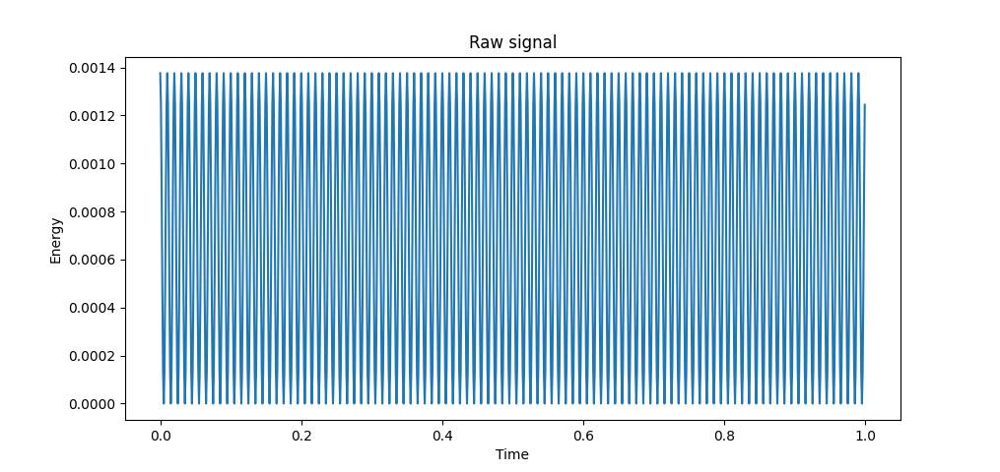
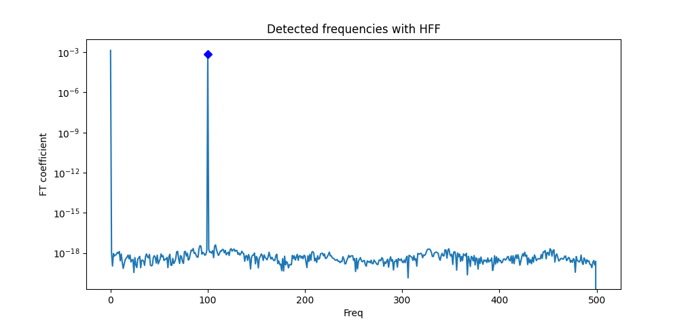
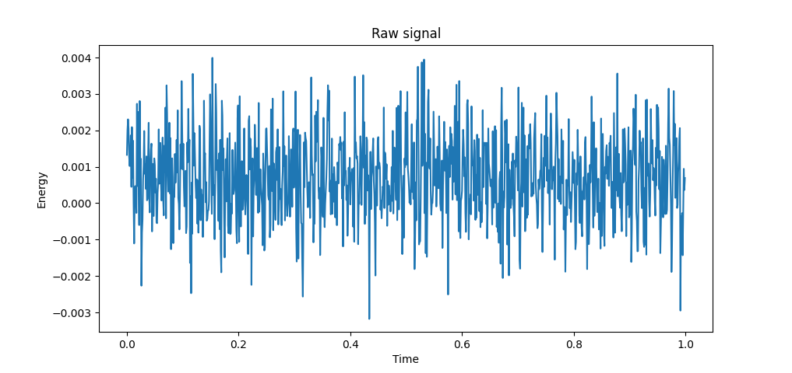
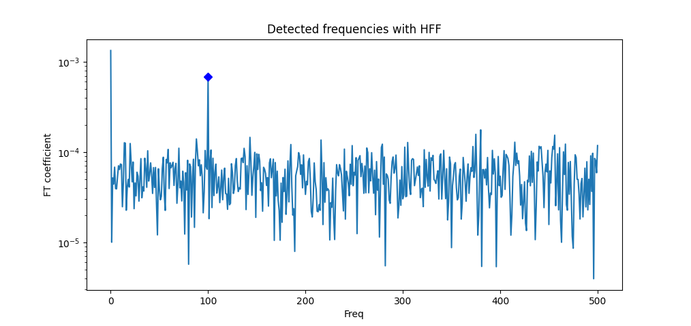

# High Frequency Features
The HFF detection method was adapted from reference [1] (available [here](https://hal.archives-ouvertes.fr/hal-02263522/file/DHMR_rev_mm8.pdf)).  However, I only took and refactored the parts useful/needed for our project. If the structure of the data we are analyzing changes in the future, it may be the case that we need to go back to the paper and add certain parts I ommited. For example, the smoothing step was ommited but may be needed if the "signal observed displays singularities e.g. a jump discontinuity or a fast transition of monotonicity of the trend." This should be straightforward to do if needed.

The output of this method is the detected most significant frequency and the estimated amplitude of the signal. This last one is important since it works even with a moderate amount of noise, where the amplitude of the pure signal may not be very clear by just looking at the graph.

## Example
The data is generated by setting `m_phi = 100 * np.pi `, `time_interval = 0.001 `, and `total_time = 1`. The data function is a cosine squared with some amplitude, and `m_phi` controls the frequency of the signal.  The first two graphs correspond to the pure data, i.e., without any noise. The last two graphs correspond to the data with noise. As you can see, in both the method is able to detect the frequency 100. 

### Pure signal

### Noisy signal

In both cases the detected frequency is 100. In the noisy case, the estimated amplitude is 0.0006728507775607192. The real amplitude, form the pure signal is 0.0006882331185892474. As you can see, HFF is able to estimate the amplitude quite well. 

## References 
[1] Mathieu Mezache, Marc Hoffmann, Human Rezaei, Marie Doumic. Testing for high frequency features in a noisy signal. 2019. ffhal-02263522v2f