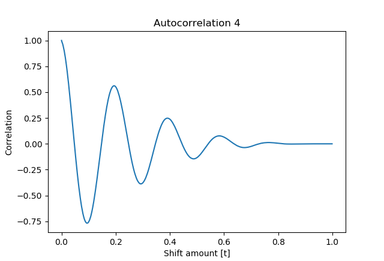

# Autocorrelation
The autocorrelation method is a good way to denoise the signal while maintaining the same periodicity.

To autocorrelate a signal, one first takes that signal and offsets it by `dt`. This shifted signal is then correlated with the original function.
Doing this for all possible offsets yields an autocorrelation function `F(dt)` whose values span from -1 to 1, where the y-axis represents the amount of correlation and the x-axis stands for the corresponding offset of the correlated signals.

The idea behind this method is that any aperiodic noise will have more or less the same correlation at each `dt` as we assume it to be random. The periodic signal on the other hand will always have a spike in correlation whenever `dt` is a multiple of the wavelength, as then the periodic part of the function sits perfectly on top of the periodic part of the offset function.

## Example
The data is generated by setting `m_phi = 10 * np.pi `, `time_interval = 0.001 `, and `total_time = 1`. The data function is a cosine squared with some amplitude, and `m_phi` controls the frequency of the signal. The first graph shows the noisy data and right below it its fourier transform. Below, you can see the autocorrelated graph and how its noise amount is visibly lower. This also leads to a cleaner fourier transform with better distinguishable peaks.

### Noisy signal

### Autocorrelated signal

## Autocorrelating autocorrelation graphs

One upside of this method is that by chaining the method together one can further and further diminish the noise amount. This is clearly visible in the following series of autocorrelations:

