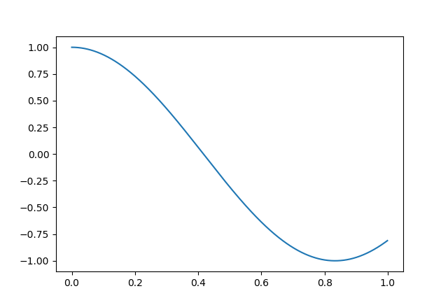
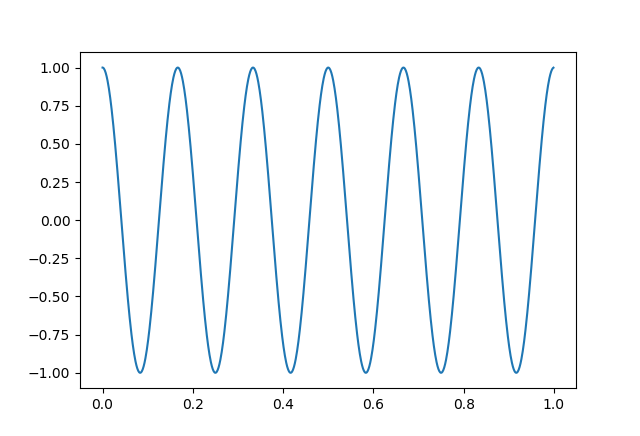
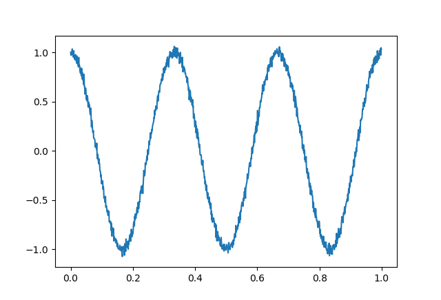
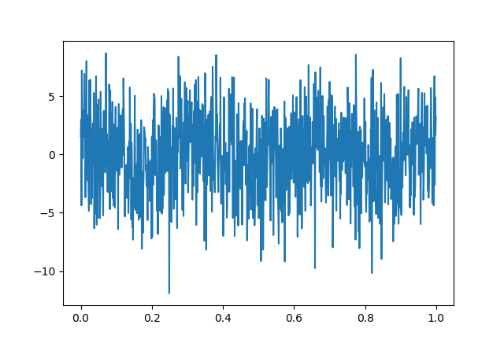

# Test samples
In order to assure an easy way to compare our methods, one could do all the testing on the same set of samples. That is what the file `test_samples.json` is for.

## Structure

All signals are simulated over the same time domain. The first entry is denoted by `domain` and contains an array of numbers corresponding to that domain.

The second entry is denoted by `signals` and contains a `10x10x3` array. The x indices are the frequencies and they range from `0` to `10.78` in even steps. The y indices are the deviations of the used noises from `0` to `3` in square steps, i.e. through the formula `i^2 / 30` for all i from `0` to `9`.

### Therefore, the frequency ranges as follows:
From

to

### And the deviation ranges as follows:
From

to

In addition, the first rows and columns contain zero noise or deviation, respectively.

The z indices, at last, are numbers from `0` to `2`, as all signals are repeated three times with different random noises.
